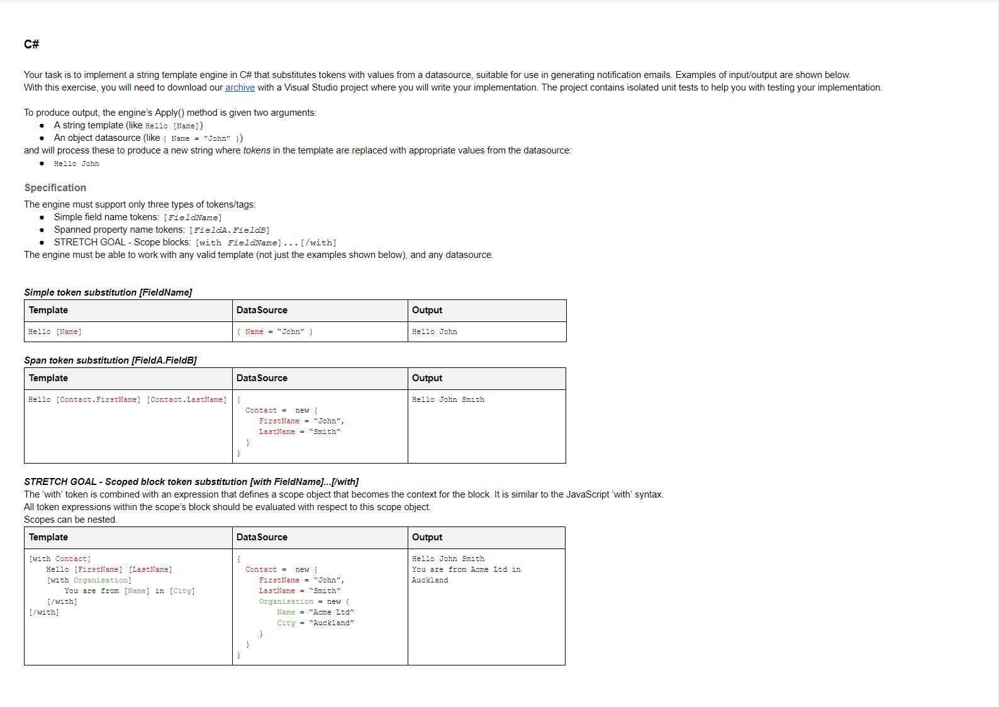
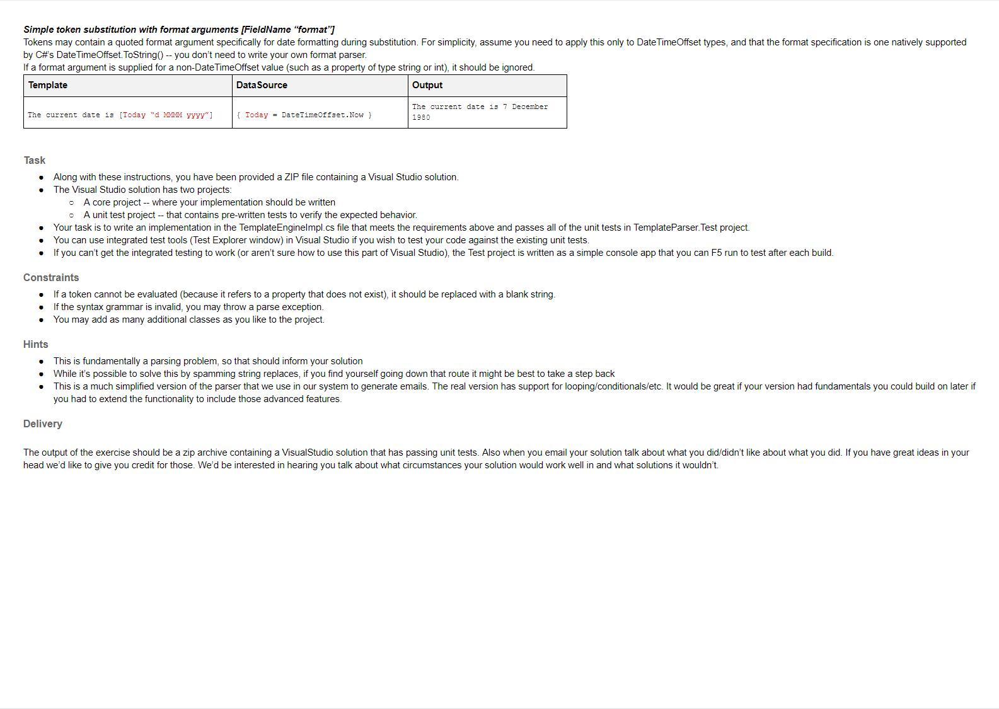

# Personal Description

All of my work has explained in the Report.pdf.

#  Test Description

## Developer Test (Backend)

* You will need access to a computer with Microsoft Visual Studio (use free version if required).
* At the end of the test, if you have not completed the tasks, explain what you would have done next.
* This test is in C#, but if you think you can show off your skills better in another language, we’ll accept solutions in Java and Python as well.

Thanks, and good luck!

